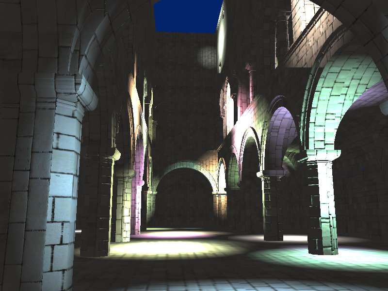

WebGL Deferred Shading
======================

**University of Pennsylvania, CIS 565: GPU Programming and Architecture, Project 6**

* (TODO) YOUR NAME HERE
* Tested on: (TODO) **Google Chrome 222.2** on
  Windows 22, i7-2222 @ 2.22GHz 22GB, GTX 222 222MB (Moore 2222 Lab)

### Live Online

### (TODO: Your README)

Instructions (delete me)
========================

This is due at midnight on the evening of Sunday, October 25.

**Summary:** In this project, you'll be introduced to the basics of deferred
shading and WebGL. You'll use GLSL and WebGL to implement a deferred shading
pipeline and various lighting and visual effects.

**Recommendations:**
Take screenshots as you go. Use them to document your progress in your README!

Read (or at least skim) the full README before you begin, so that you know what
to expect and 

### Running the code

If you have Python, you should be able to run `server.js` to start a server.
Then, open [`http://localhost:10565/`](http://localhost:10565/) in your browser.

This project requires a WebGL-capable web browser with support for
`WEBGL_draw_buffers`. You can check for support on
[WebGL Report](http://webglreport.com/).

Google Chrome works best on all platforms. If you have problems running the
starter code, use Chrome or Chromium, and make sure you have updated your
browser and video drivers.

## Requirements

**Ask on the mailing list for any clarifications.**

In this project, you are given code for:

* Loading OBJ files and textures
* Camera control
* Partial implementation of deferred shading

You will need to implement the following features:

* Blinn-Phong shading (diffuse + specular)
* One of the following effects:
  * Bloom [1]
  * Toon shading (with ramp shading + edge detection for outlines)
* Screen-space ambient occlusion [2]
* Optimized g-buffer format
  * e.g. pack values together, quantize values, use 2-component normals, etc.
  * For credit, you must compare the performance of each permutation you test
    while optimizing in a simple table.

You must do at least **8 points** worth of extra features.

**INSTRUCTOR TODO:** review point values

* (5pts) The effect you didn't choose above
* (5pts) Motion blur [3]
* (3pts) Two-pass Gaussian blur using separable convolution (using a second
  postprocess render pass) to improve bloom performance
* (5pts) Tile-based deferred shading with detailed performance comparison
* (3pts) Scissor test optimization: when accumulating shading from each point
  light source, only render in a rectangle around the light (must be correct).
* Compare performance to normal forward-rendering with no optimizations and
  with:
  * (3pts) Coarse front-to-back sorting of geometry for early-z
    * (Of course) must render many objects per frame to test
  * (2pts) Z-prepass for early-z

This extra feature list is not comprehensive. If you have a particular idea
that you would like to implement, please **contact us first** (preferably on
the mailing list).

**All togglable features should be switchable using the GUI panel.**

**IMPORTANT:** For each feature (required or extra), please provide the
following brief analysis:

* Concise overview write-up of the feature.
* Performance hit/improvement due to adding the feature.
* If you did something to accelerate the feature, what did you do and why?
* How might this feature be optimized beyond your current implementation?

### Starter Code Tour

You'll be working in `deferredSetup.js` and `deferredRender.js` using raw
WebGL. While there is Three.js code in the project for other purposes, you
probably won't find it useful for implementing your pipeline.

It's highly recommended that you use the browser debugger to inspect variables
to get familiar with the code. At any point, you can `console.log(some_var);`
to show it in the console and inspect it.

* `js/`: JavaScript files for this project.
  * `main.js`: Handles initialization of other parts of the program.
  * `framework.js`: Loads the scene, camera, etc., and calls your setup/render
    functions. Hopefully, you won't need to change anything here.
  * `deferredSetup.js`: Your deferred shading pipeline setup code.
  * `deferredRender.js`: Your deferred shading pipeline execution code.
  * `ui.js`: Defines the UI using
    [dat.GUI](https://workshop.chromeexperiments.com/examples/gui/).
    * The global variable `cfg` can be accessed anywhere in the code to read
      configuration values.
  * `utils.js`: Utilities for JavaScript and WebGL.
    * `abort`: Aborts the program and shows an error.
    * `loadTexture`: Loads a texture from a URL into WebGL.
    * `loadShaderProgram`: Loads shaders from URLs into a WebGL shader program.
    * `createAndBind(Depth/Color)TargetTexture`: Creates empty textures for
      binding to frame buffer objects as render targets.
    * `renderFullScreenQuad`: Renders a full-screen quad with the given shader
      program.
* `glsl/`: GLSL code for each part of the pipeline:
  * `clear.*.glsl`: Clears each of the `NUM_GBUFFERS` g-buffers.
  * `copy.*.glsl`: Performs standard rendering without any fragment shading,
    storing all of the resulting values into the `NUM_GBUFFERS` g-buffers.
  * `quad.vert.glsl`: Minimal vertex shader for rendering a single quad.
  * `deferred.frag.glsl`: Deferred shading pass (for lighting calculations).
    Reads from each of the `NUM_GBUFFERS` g-buffers.
  * `post1.frag.glsl`: First post-processing pass.
* `lib/`: JavaScript libraries.
* `models/`: OBJ models for testing.
  * Sponza is the default.
* `index.html`: Main HTML page.
* `server.bat` (Windows) or `server.py` (OS X/Linux):
  Runs a web server on your local machine.

### The Deferred Shading Pipeline

See the comments in `deferredSetup.js`/`deferredRender.js` for low-level guidance.

**Pass 1:** Renders the scene geometry and its properties to the g-buffers.
* `copy.vert.glsl`/`copy.frag.glsl`
* The framebuffer object `pass_copy.fbo` must be bound during this pass.
* Renders into `pass_copy.depthTex` and `pass_copy.gbufs[i]`, which need to be
  attached to the framebuffer.

**Pass 2:** Performs lighting and shading into the color buffer.
* `quad.vert.glsl`/`deferred.frag.glsl`
* Takes the g-buffers `pass_copy.gbufs`/`depthTex` as texture inputs to the
  fragment shader, on uniforms `u_gbufs` and `u_depth`.
* `pass_deferred.fbo` must be bound.
* Renders into `pass_deferred.colorTex`.

**Pass 3:** Performs post-processing.
* Takes `pass_deferred.colorTex` as a texture input `u_color`.
* Renders directly to the screen if there are no additional passes.

More passes may be added for additional effects (e.g. combining bloom with
motion blur) or optimizations (e.g. two-pass Gaussian blur for bloom)

#### Debugging

If there is a WebGL error, it will be displayed on the developer console and
the renderer will be aborted. To find out where the error came from, look at
the backtrace of the error (you may need to click the triangle to expand the
message). The line right below `wrapper @ webgl-debug.js` will point to the
WebGL call that failed.

#### Changing the number of g-buffers

Note that the g-buffers are just `vec4`s - you can put any values you want into
them. However, if you want to change the total number of g-buffers (add more
for additional effects or remove some for performance), you will need to make
changes in a number of places:

* `deferredSetup.js`/`deferredRender.js`: search for `NUM_GBUFFERS`
* `copy.frag.glsl`
* `deferred.frag.glsl`
* `clear.frag.glsl`

## Resources

* [1] Bloom:
  [GPU Gems, Ch. 21](http://http.developer.nvidia.com/GPUGems/gpugems_ch21.html) 
* [2] Screen-Space Ambient Occlusion:
  [Floored Article](http://floored.com/blog/2013/ssao-screen-space-ambient-occlusion.html)
* [3] Post-Process Motion Blur:
  [GPU Gems 3, Ch. 27](http://http.developer.nvidia.com/GPUGems3/gpugems3_ch27.html)

## README

Replace the contents of this README.md in a clear manner with the following:

* A brief description of the project and the specific features you implemented.
* At least one screenshot of your project running.
* A 30+ second video of your project running showing all features.
  [Open Broadcaster Software](http://obsproject.com) is recommended.
  (Even though your demo can be seen online, using multiple render targets
  means it won't run on many computers. A video will work everywhere.)
* A performance analysis (described below).

### Performance Analysis

Analyze the performance on any features or optimizations that you implemented.
What are the gains? What are the losses? Are there tradeoffs? How do parameters
(such as number of lights, tile size, etc.) affect performance?

**Required:** Optimize your JavaScript and/or GLSL code. Web Tracing Framework
and Chrome/Firefox's profiling tools will be useful for this. For each change
that improves performance, show the before and after render times.

**Notes:**

* Before doing performance analysis, you must disable debug mode by changing
`debugMode` to `false` in `framework.js`.
* Be aware that stats.js may give 0 millisecond frame timings in Chrome on
occasion - if this happens, you can use the FPS counter.

### GitHub Pages

Since this assignment is in WebGL, you can make your project easily viewable by 
taking advantage of GitHub's project pages feature.

Once you are done with the assignment, create a new branch:

`git branch gh-pages`

Push the branch to GitHub:

`git push origin gh-pages`

Now, you can go to `<user_name>.github.io/<project_name>` to see your
renderer online from anywhere.

## Submit

1. Open a GitHub pull request so that we can see that you have finished.
   The title should be "Submission: YOUR NAME".
   * **ADDITIONALLY:**
     In the body of the pull request, include a link to your repository.
2. Send an email to the TA (gmail: kainino1+cis565@) with:
   * **Subject**: in the form of `[CIS565] Project N: PENNKEY`.
   * Direct link to your pull request on GitHub.
   * Estimate the amount of time you spent on the project.
   * If there were any outstanding problems, briefly explain.
   * **List the extra features you did.**
   * Feedback on the project itself, if any.

### Third-Party Code Policy

* Use of any third-party code must be approved by asking on our mailing list.
* If it is approved, all students are welcome to use it. Generally, we approve
  use of third-party code that is not a core part of the project. For example,
  for the path tracer, we would approve using a third-party library for loading
  models, but would not approve copying and pasting a CUDA function for doing
  refraction.
* Third-party code **MUST** be credited in README.md.
* Using third-party code without its approval, including using another
  student's code, is an academic integrity violation, and will, at minimum,
  result in you receiving an F for the semester.
